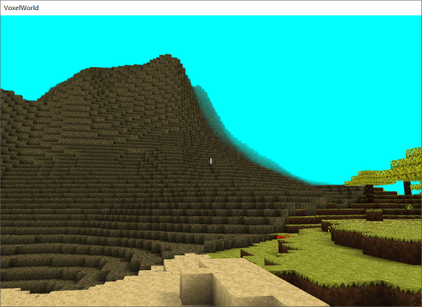

# VoxelWorld

---

A minecraft-like voxel world renderer written in C++ with DirectX 11. [OWE](https://github.com/AirGuanZ/OWE) is used for shader management. Following features were implemented:

- [x] Sunlight & colorful light sources
- [x] Dynamicly create/destroy chunks according to the position of camera
- [x] Voxel Ambient occlusion
- [x] Collision detection
- [x] Fog
- [x] Random land generation based on Vorinoi diagram and perlin noise
- [x] Place/break blocks
- [x] Third personal perspective
- [ ] Voxel character editor (under development)

Use `WASD` to move the camera; press `Space` to jump. Click `LB` to break a block and `RB` to place a red glow stone. Press `T` to shorten the length of one day. Things like inventory haven't been implemented, so there is no method to change the type of block in hand, except modifying codes.

Modify `VoxelWorld/config.txt` to change some runtime properties like resolution, rendering distance and fog distance.

---

Screenshots:

