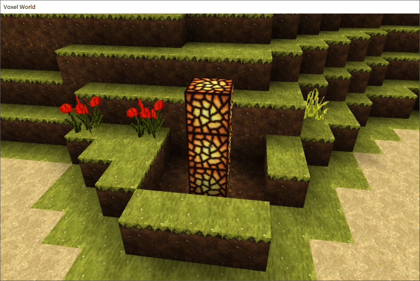
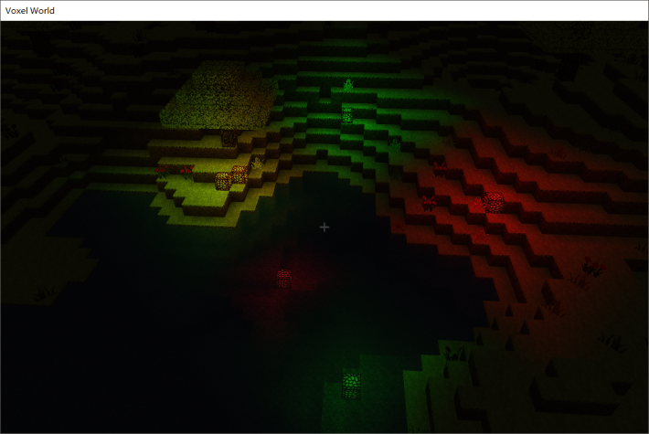

# Voxel World

---

基于DirectX 11实现，使用DirectXTK来加载纹理。

---

以minecraft世界为原型，未来将添加更多内容。

- [x] 半透明方块渲染
- [x] 简单的世界生成，包括山丘、水域和花草树木
- [x] 光照计算，包括太阳光和彩色光源
- [x] 根据摄像机的位置动态加/卸载区块
- [x] 环境光遮蔽
- [ ] 碰撞检测
- [ ] 日夜变换
- [ ] 雾效果
- [ ] 物品栏

以鼠标移动来转动镜头，WASD移动，Space上升，Left Shift下降。鼠标左键破坏方块，右键放置蓝色萤石。按住z键时右键放置的萤石为红色，否则按住x键时放置的萤石为绿色。

---

截图：

